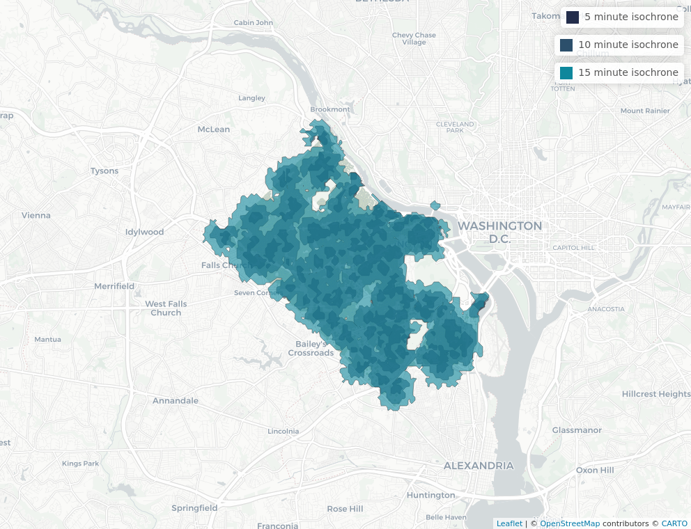
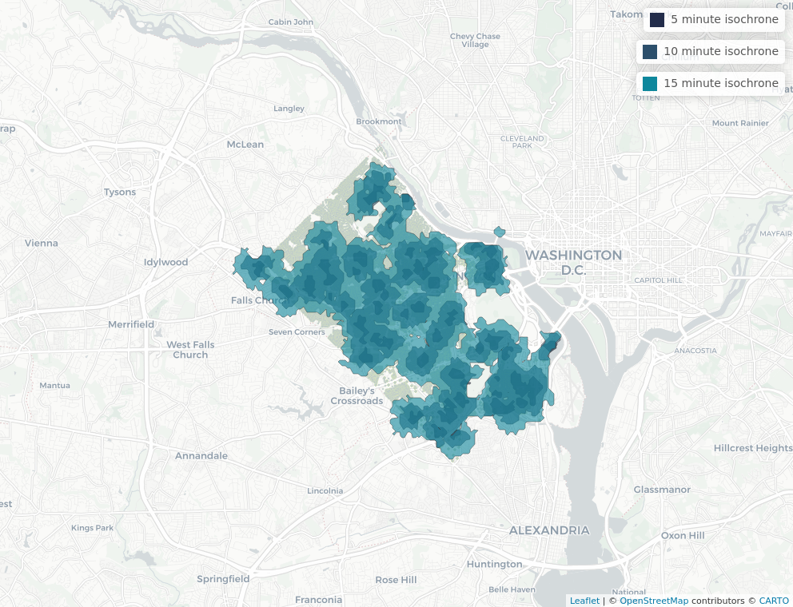
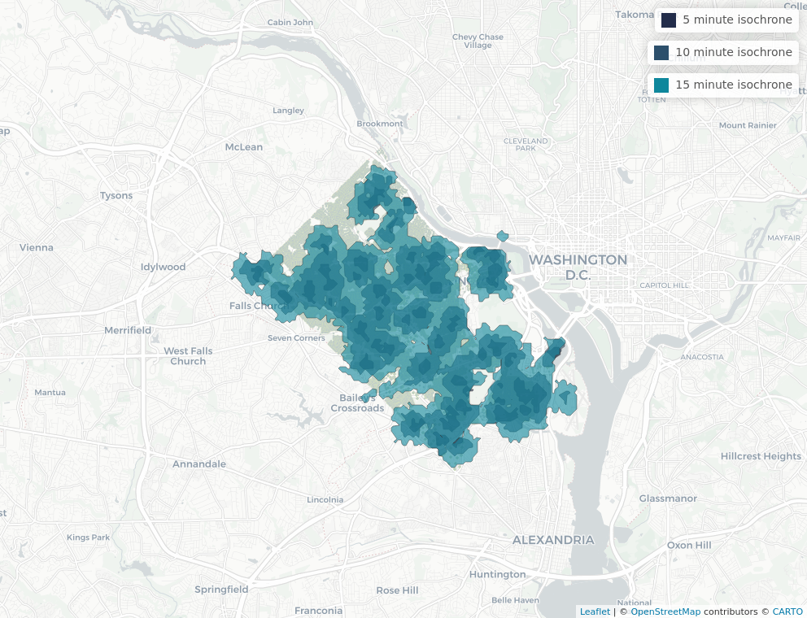
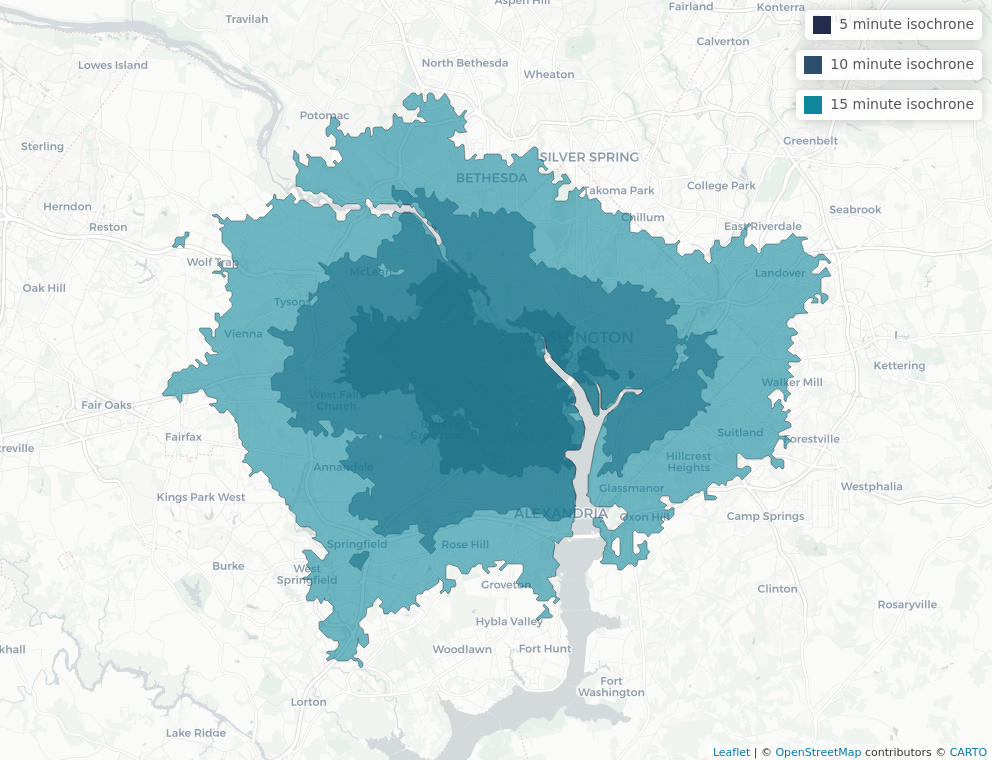

```{js echo=FALSE}

   document.getElementsByTagName('a')[0].innerHTML = ''

   document.getElementsByClassName('navbar-header')[0].style = 'margin-top:-10px;'

```

```{r setup, include=FALSE}
knitr::opts_chunk$set(echo = FALSE)
knitr::opts_chunk$set(warning = FALSE, message = FALSE) 
knitr::opts_knit$set(root.dir = rprojroot::find_rstudio_root_file())
root.dir = rprojroot::find_rstudio_root_file()

library(tidyverse)
library(sf)
library(sp)
library(mapview)
library(leaflet)
library(SpatialAcc)
library(osrm)
library(dplyr)
library(tidycensus)
library(png)
```

## Demographics


## Park Access
```{r}
colors <- c("#232d4b","#2c4f6b","#0e879c","#60999a","#d1e0bf","#d9e12b","#e6ce3a","#e6a01d","#e57200","#fdfdfd")

residential <- read_sf("/home/mes5bu/git/mc/data/working/corelogic/residential.csv")
residential_sf <- st_as_sf(residential, coords = c("parcel_level_longitude", "parcel_level_latitude"))
st_crs(residential_sf) <- "+proj=longlat +datum=WGS84"
residential = mapview(st_geometry(residential_sf), cex =.5, layer.name = "residential areas", color = colors[5])
```

### Traveltime Isochrone Method

To get an idea of parck access, we computed coverage as the percentage of total residences that are covered within time-based isochrones from the centroid of each park. We did this for walking, driving, and public transportation. Here we feature the walking map. 

#### Walking

When we create access polygons as 5-, 10-, and 15-minute polygons of walking, 32 percent, 85, ad 99 percent of residences are covered respectively. Within a short walk this isn't very high coverage, but within 10 minutes this is high coverage.

```{r walking}
table <- read.csv(file = "/home/mes5bu/git/mc/data/working/park_iso_table.csv")
knitr::kable(table)
```

{style="width:60%"}

### Amenity Access

To measure park access we also care about measuring access to good parks. To measure park goodness we use amenities as a proxy variable. The following maps and tables measure individual's access to different types of amenities. We did this for tennis courts, basketball courts, playgrounds, and parking. We will highlight playgrounds below. 

#### Playgrounds

So similarly to what we saw above, we now evaluate access in terms of the percent of total residences in the county that have access to the playground amenity within a 5-, 10-, or 15-minute isochrone via walking, public transportation, or driving.

##### Walking

```{r playground}
table <- read.csv("./data/working/traveltime_isochrones/park_iso_playground.csv")
knitr::kable(table)
```
{style="width:60%"}

##### Public Transportation

```{r pt playground}
table <- read.csv("./data/working/traveltime_isochrones/park_iso_pt_playground.csv")
knitr::kable(table)
```
{style="width:60%"}

##### Driving
```{r playground drv}
table <- read.csv("./data/working/amenities_web/park_iso_drv_playground.csv")
knitr::kable(table)
```
{style="width:60%"}

### Floating Catchment

In addition we want to look at how park access is distributed across racial groups. We use the two-step floating catchment area method to calculate spatial accessibility scores for Census tracts in Arlington County by race. These scores give a measure of accessibility for each tract to the parks and their amenities in Arlington County and are calculated as the summation of the supply to demand ratio for each park contained in the catchment area of the Census tract. The supply of a park is defined by its acreage and its demand is defined by the total population count of a racial group in a Census tract. The catchment areas for both the parks as well as Census tracts are defined by a distance of one mile. Census tracts with higher scores are considered to have more accesibility to parks and their amenities.

#### Black 
Here we highlight the TSFCA score for black community members in Arlington County by tract. We observed that for the Black, Asian, and Other populations, however, there are high levels of accessibility in the Northern region. This is due to the fact that those areas have a number of large acreage parks combined with the low numbers of people who identify as Black, Asian, or Other.  

```{r, include=FALSE}

# read in ACS data
#Sys.getenv("CENSUS_API_KEY")

acs_vars <- c(  
  # total population
  "B01003_001",
  # Hispanic ethnicity
  "B03001_003", "B03001_001",
  # White
  "B02001_002", "B02001_001",
  # Black
  "B02001_003",
  # Asian
  "B02001_005",
  # Other
  "B02001_004", "B02001_006", "B02001_007",
  "B02001_008", "B02001_009", "B02001_010"
  )

data_tract <- get_acs(geography = "tract", 
                      state = 51, 
                      county = 013,
                      variables = acs_vars,
                      year = 2019, 
                      survey = "acs5",
                      cache_table = TRUE, 
                      output = "wide", 
                      geometry = TRUE,
                      keep_geo_vars = TRUE)

acs_tract <- data_tract %>%
  transmute(STATEFP = STATEFP,
            COUNTYFP = COUNTYFP,
            TRACTCE = TRACTCE,
            GEOID = GEOID,
            NAME.x = NAME.x,
            NAME.y = NAME.y,
            ALAND = ALAND,
            AWATER = AWATER,
            total_pop = B01003_001E,
            hispanic = B03001_003E,
            white = B02001_002E,
            black = B02001_003E,
            asian = B02001_005E,
            other_race = B02001_004E + B02001_006E + B02001_007E + B02001_008E + B02001_009E + B02001_010E
            )

acs_tract$total_pop[acs_tract$total_pop == 0] <- 0.0001
acs_tract$hispanic[acs_tract$hispanic == 0] <- 0.0001
acs_tract$white[acs_tract$white == 0] <- 0.0001
acs_tract$black[acs_tract$black == 0] <- 0.0001
acs_tract$asian[acs_tract$asian == 0] <- 0.0001
acs_tract$other[acs_tract$other == 0] <- 0.0001

data_bgrp <- get_acs(geography = "block group", 
                     state = 51, 
                     county = 013,
                     variables = acs_vars,
                     year = 2019, 
                     survey = "acs5",
                     cache_table = TRUE, 
                     output = "wide", 
                     geometry = TRUE,
                     keep_geo_vars = TRUE)

acs_bgrp <- data_bgrp %>%
  transmute(STATEFP = STATEFP,
            COUNTYFP = COUNTYFP,
            TRACTCE = TRACTCE,
            GEOID = GEOID,
            NAME.x = NAME.x,
            NAME.y = NAME.y,
            ALAND = ALAND,
            AWATER = AWATER,
            total_pop = B01003_001E,
            hispanic = B03001_003E,
            white = B02001_002E,
            black = B02001_003E,
            asian = B02001_005E,
            other_race = B02001_004E + B02001_006E + B02001_007E + B02001_008E + B02001_009E + B02001_010E
  )

acs_bgrp$total_pop[acs_bgrp$total_pop == 0] <- 0.0001
acs_bgrp$hispanic[acs_bgrp$hispanic == 0] <- 0.0001
acs_bgrp$white[acs_bgrp$white == 0] <- 0.0001
acs_bgrp$black[acs_bgrp$black == 0] <- 0.0001
acs_bgrp$asian[acs_bgrp$asian == 0] <- 0.0001
acs_bgrp$other[acs_bgrp$other == 0] <- 0.0001

## park data
# transform to utm with meter units
parks <- st_read(paste0(root.dir, "/data/original/arlington_parks/Park_Polygons.shp")) %>%
  filter(Ownership == "Arlington County Park")

# amenities
parks_amenities <- read.csv(paste0(root.dir, "/data/working/parks_amenities.csv"))

tract_dist_mat <- read.csv(paste0(root.dir, "/data/working/park_to_tract_dist_mat.csv"))

bgrp_dist_mat <- read.csv(paste0(root.dir, "/data/working/park_to_bgrp_dist_mat.csv"))
```

```{r tract}
white_tract_tsfca <- ac(p = acs_tract$white, 
                        n = parks$Acreage, 
                        D = tract_dist_mat, 
                        d0 = 1609, 
                        family = "2SFCA")

acs_tract$white_tract_tsfca <- white_tract_tsfca

black_tract_tsfca <- ac(p = acs_tract$black, 
                        n = parks$Acreage, 
                        D = tract_dist_mat, 
                        d0 = 1609, 
                        family = "2SFCA")

acs_tract$black_tract_tsfca <- black_tract_tsfca

asian_tract_tsfca <- ac(p = acs_tract$asian, 
                        n = parks$Acreage, 
                        D = tract_dist_mat, 
                        d0 = 1609, 
                        family = "2SFCA")

acs_tract$asian_tract_tsfca <- asian_tract_tsfca

other_tract_tsfca <- ac(p = acs_tract$other, 
                        n = parks$Acreage, 
                        D = tract_dist_mat, 
                        d0 = 1609, 
                        family = "2SFCA")

acs_tract$other_tract_tsfca <- other_tract_tsfca
```

```{r tract_plots_black}
# black
mapview(st_geometry(parks), 
        cex =.5, 
        layer.name = "Parks in Arlington County", 
        col.region = "gray",
        color = "gray") + 
  mapview(acs_tract, 
          zcol = "black_tract_tsfca", 
          layer.name = "TSFCA",  
          col.regions = sf.colors(alpha = 0.1))
```